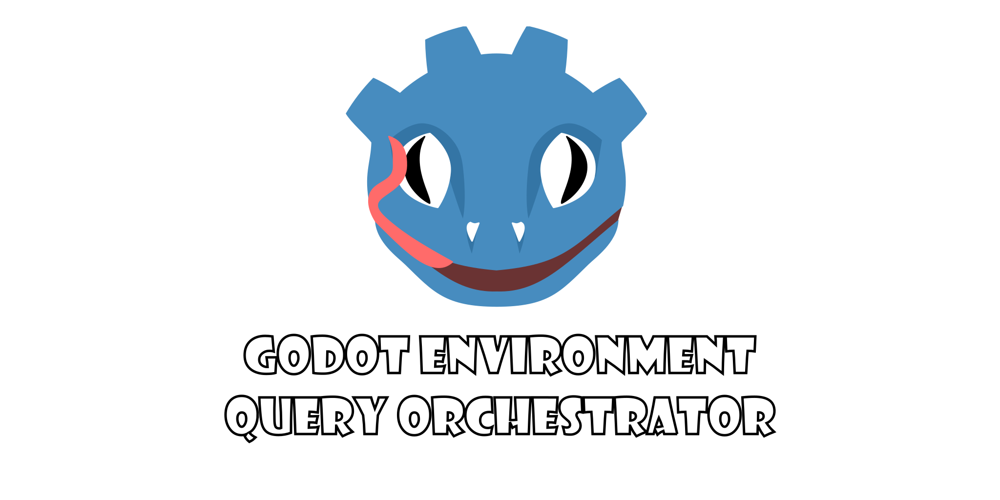

Date started: Oct 30, 2025

Godot Environment Query Orchestrator (GEQO) is a node-based environment querying system for Godot 4.5+, inspired by Unreal Engine's EQS. It allows AI agents to evaluate the world around them and select the best position/node/item based on customizable generators and tests (e.g distance, visibility), made around contexts (Any node with a position value). It is implemented in C++ as a GDExtension for higher performance.

<!--more-->

It can be found **[here](https://github.com/geqo-godot/geqo)**

